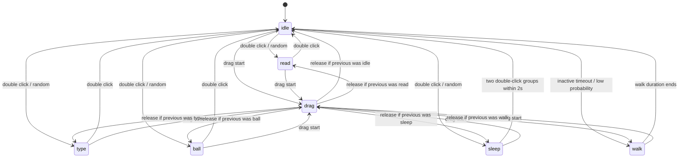

# Xiaowang State Diagram

这张图是文档里 Stage 4 要求的状态转移图草稿。正式写代码前，你可以在纸上再画一遍，把概率和触发条件补成自己的版本。

```mermaid
stateDiagram-v2
    [*] --> idle
    idle --> read: double click / random
    idle --> type: double click / random
    idle --> ball: double click / random
    idle --> sleep: double click / random
    idle --> walk: inactive timeout / low probability

    read --> idle: double click
    type --> idle: double click
    ball --> idle: double click
    sleep --> idle: two double-click groups within 2s
    walk --> idle: walk duration ends

    idle --> drag: drag start
    read --> drag: drag start
    type --> drag: drag start
    ball --> drag: drag start
    sleep --> drag: drag start
    walk --> drag: drag start
    drag --> idle: release if previous was idle
    drag --> read: release if previous was read
    drag --> type: release if previous was type
    drag --> ball: release if previous was ball
    drag --> sleep: release if previous was sleep
    drag --> walk: release if previous was walk
```
